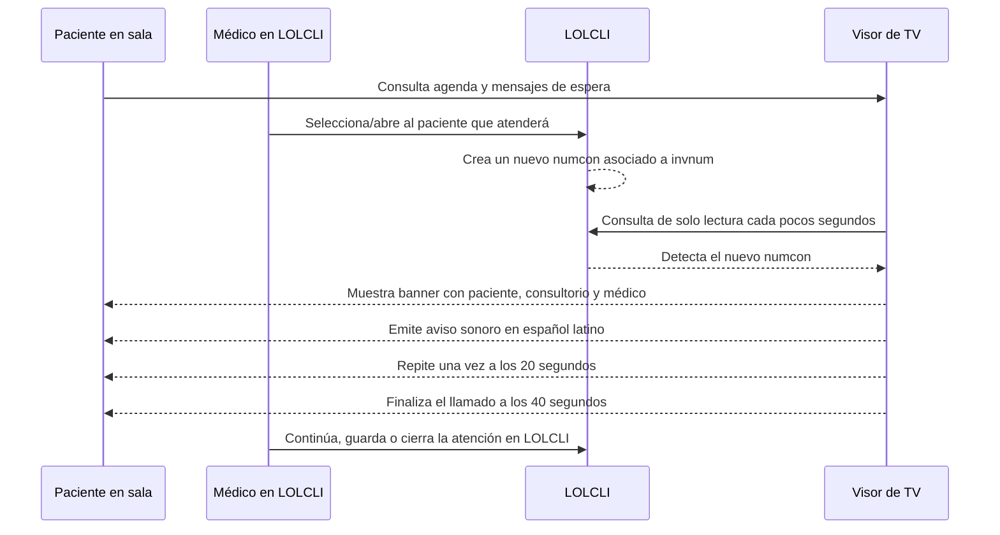

# Guía de exposición: Visor público de turnos

Última actualización: 2026-09-19.

## Objetivo en una frase

El visor informa de manera visual y sonora qué paciente fue llamado por el médico en LOLCLI, y presenta la agenda próxima de la sede sin que la televisión modifique datos clínicos ni administrativos.

## Roles

| Participante | Qué hace | Qué no hace |
| --- | --- | --- |
| Paciente | Observa el turno llamado y se acerca cuando su nombre aparece en pantalla. | No interactúa con la televisión. |
| Médico | Revisa su agenda y selecciona/abre al paciente en LOLCLI cuando decide atenderlo. | No necesita operar el visor. |
| LOLCLI | Al abrir el acto registra un nuevo `numcon`, que es la señal del llamado. | No recibe cambios desde el visor. |
| Visor de TV | Consulta LOLCLI en modo lectura, muestra el llamado, reproduce el aviso y actualiza las listas. | No crea citas, actos, prefacturas ni cierres. |
| Soporte | Mantiene la PC/TV, red interna, navegador, servicio web y conectividad de lectura. | No altera la cola médica desde el visor. |

## Flujo principal

## Qué muestra la televisión

1. **Banner principal**
   - Si hay un llamado: nombre del paciente, consultorio y profesional, con aviso visual y sonoro.
   - Si no hay un llamado: mensajes breves de orientación para la sala de espera, por ejemplo: “Acérquese al consultorio solo cuando aparezca su nombre”.

2. **Próximos por consultorio**
   - Presenta el consultorio que está rotando en la pantalla y sus pacientes próximos.
   - El indicador puede decir **Llamando** cuando ese consultorio tiene el acto activo o **Próximo** cuando no lo tiene.

3. **Próximos turnos**
   - Presenta citas agendadas de la jornada que siguen vigentes según la hora actual del visor.
   - Se ordenan por hora programada ascendente.
   - Una cita cuya hora ya pasó y que no fue abierta o atendida deja de mostrarse como “próxima”; permanece en LOLCLI para que el médico pueda decidir cómo proceder.
   - Los casos EMA o con categorías A, B, C, D o E no cambian esta agenda pública. Solo pueden afectar el orden interno de llamados cuando el médico ya generó un nuevo `numcon`.

## Reglas importantes del llamado

- El visor **no llama automáticamente** por la hora de la cita.
- El médico conserva la decisión clínica y operativa: al abrir al paciente en LOLCLI se genera el `numcon` que activa el llamado.
- Un llamado activo no es interrumpido por otro. La TV tiene un único audio y procesa los llamados habilitados en orden.
- Cada llamado permanece 40 segundos y tiene una única repetición a los 20 segundos.
- Al finalizar el visor no determina si el paciente se presentó ni modifica LOLCLI. El médico define el siguiente paso desde su módulo.
- El visor solo consulta LOLCLI: no escribe, no crea prefacturas y no cierra atenciones.

## Guion de demostración para médicos (3 minutos)

1. Abra el visor en la TV y explique las tres zonas: banner, consultorio rotativo y próximos turnos.
2. Indique que la lista derecha sirve para orientar a los pacientes según su hora agendada; no realiza llamados automáticos.
3. En LOLCLI, abra un paciente de prueba o el siguiente paciente real autorizado.
4. Explique que LOLCLI crea el nuevo `numcon` y que el visor lo detecta sin que el médico haga nada adicional en la TV.
5. Muestre el banner, el consultorio y la locución: “Paciente [nombre], pase al consultorio [nombre]”.
6. Indique que la voz está configurada para español latino y que el llamado dura 40 segundos, con una repetición a los 20 segundos.
7. Vuelva a LOLCLI para guardar/cerrar la atención o continuar con el siguiente paciente. Recalque que todo el control asistencial continúa dentro de LOLCLI.

## Guion para soporte (2 minutos)

1. La televisión solo abre la URL interna `/turnos` en el navegador; no requiere usuario ni acceso directo a SQL Server.
2. La aplicación web consulta LOLCLI mediante ODBC con permisos exclusivos de lectura y distribuye el resultado a las TVs.
3. Si se pierde la red o LOLCLI demora, el visor conserva la última información válida y muestra un aviso discreto de actualización.
4. Para una PC de la red interna, se usa la dirección del equipo que ejecuta el servicio, por ejemplo `http://IP_DEL_SERVIDOR:5280/turnos` durante el piloto HTTP.
5. Validaciones de primera línea: PC encendida, proceso web en ejecución, puerto 5280 permitido en el firewall, TV en la misma red, volumen de TV/navegador activo y navegador actualizado.
6. Soporte no debe editar ni ejecutar acciones sobre LOLCLI desde el visor; cualquier decisión de atención la realiza el personal clínico en LOLCLI.

## Mensaje de cierre para la exposición

> El visor ordena la comunicación en sala de espera. El médico conserva la decisión de llamar desde LOLCLI; la televisión solo hace visible y audible esa decisión para el paciente.
